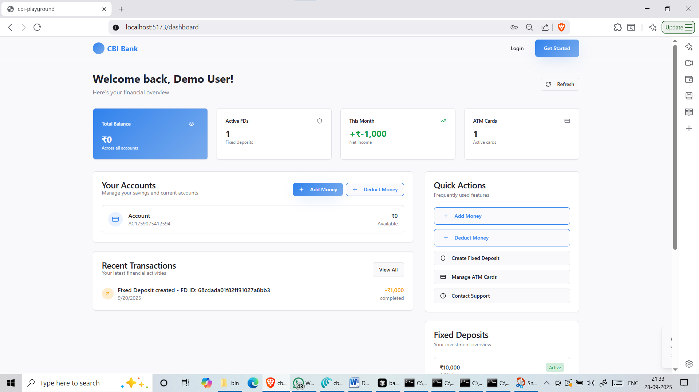

# 💳 CBI Bank – Modern Banking Application (Frontend)

A modern **banking web application** built with the MERN stack (MongoDB, Express.js, React, Node.js) and styled with Tailwind + shadcn/ui.  

The goal of this project is to **simulate digital banking services** that users expect in today’s world: account management, virtual cards, fixed deposits, and transaction tracking — all inside a clean, responsive, and intuitive interface.  

> ⚠️ **Note**: This project is still a **work in progress**. Some features are incomplete, and bugs may exist. I am continuously learning and will keep improving and expanding the project over time.  

---

## ✨ Features

- 🏦 **Banking Dashboard**  
  Overview of balances, accounts, and activity in one place.  

- 💳 **Virtual ATM Card**  
  Generate and manage digital cards — a step toward cashless banking.  

- 💰 **Fixed Deposits (FDs)**  
  Create deposits with automated interest calculation. Includes FD tracking and early-break simulation.  

- 📊 **Transaction History & Analytics**  
  View past transactions with filters, and simple analytics to understand spending/savings.  

- 🎨 **Modern UI System**  
  Built using **Tailwind CSS** + **shadcn/ui**, ensuring a polished and consistent look.  

- 🌙 **Dark/Light Mode**  
  Toggle between themes for better accessibility and user preference.  

- 📱 **Fully Responsive**  
  Works seamlessly on desktop, tablet, and mobile.  

---

## 🛠 Tech Stack

- **Frontend**: React 18, TypeScript, Vite  
- **Styling**: Tailwind CSS, shadcn/ui  
- **State & Forms**: React Hook Form, Zod  
- **Routing**: React Router  
- **Backend (planned integration)**: Node.js, Express.js, MongoDB  

---

## 📸 Screenshots

> *(You can add screenshots of your running app here. Save them inside the `screenshots/` folder and reference them like below.)*

- **Dashboard**
  

- **Login Page**
  

- **Fixed Deposit**
  

---

## 🚀 Getting Started

### Prerequisites
- Node.js **18+**
- npm or yarn

### Installation

1. Clone the repository:
   ```bash
   git clone <your-repo-url>
   cd cbi-bank-frontend
Install dependencies:

bash
Copy code
npm install
Start the development server:

bash
Copy code
npm run dev
Open http://localhost:5173 in your browser.

📂 Project Structure
bash
Copy code
src/
├── components/        # Reusable UI components
│   ├── ui/           # shadcn UI components
│   └── Layout/       # Header, Footer, etc.
├── pages/            # Application pages
├── hooks/            # Custom React hooks
├── lib/              # Utility functions
├── assets/           # Images, icons, static files
└── index.css         # Global styles
📜 Available Scripts
npm run dev – Start dev server

npm run build – Build for production

npm run preview – Preview production build

npm run lint – Run ESLint checks

🎯 Roadmap & Future Work
🔐 Authentication & Authorization (JWT based)

🏦 More banking modules (Loans, Investments, Credit Card Payments)

📱 PWA Support (installable mobile-like app)

📈 Advanced analytics dashboards with charts

🤝 Contributing
Suggestions and feedback are always welcome!

Fork the repository

Create a feature branch

Commit your changes

Submit a pull request

📄 License
This project is licensed under the MIT License.

💡 This project reflects my journey as a student developer aspiring to build real-world applications. While not yet perfect, I’m committed to learning and improving it step by step.
